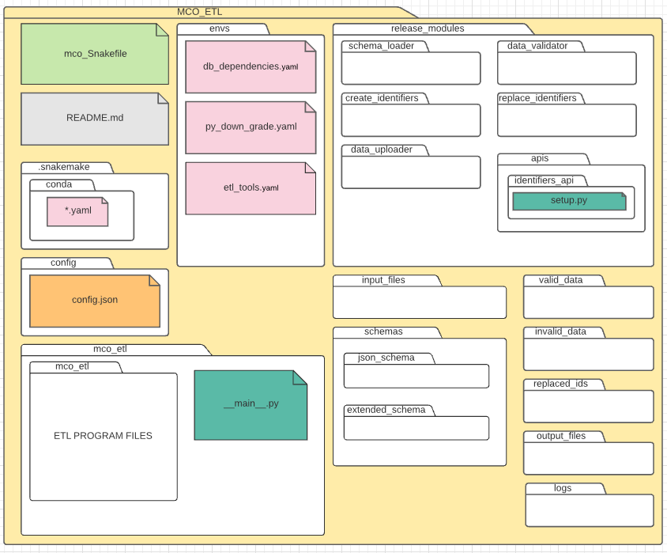
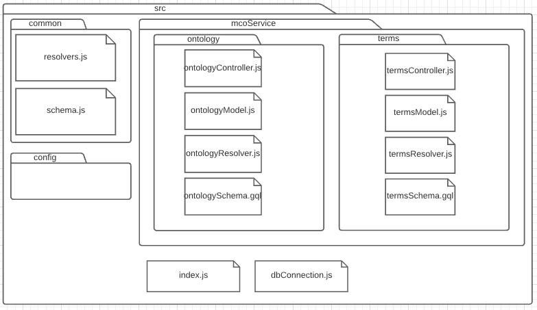
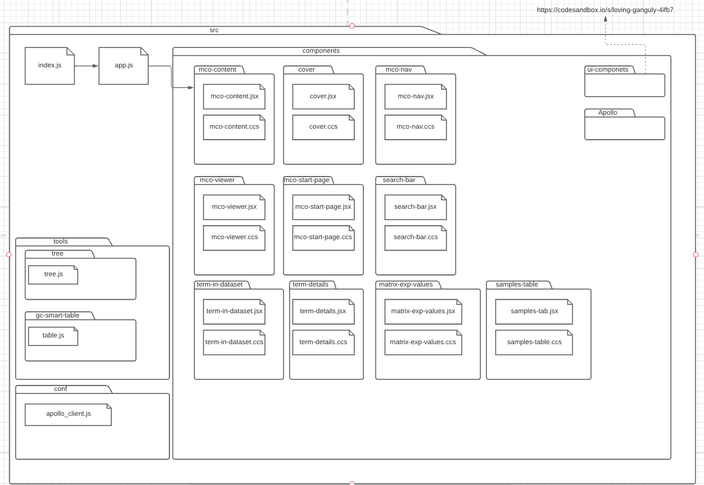

# Microbial Condition Ontology (MCO) Browser

- ## Installation instructions

For the integration of the modules it will be necessary to use external programs from RegulonDB

- ### Expected Directory Structure
  - MCO ETL Diagram
    
  - Web Service Diagram
    
    - Front End Diagram
      
- ### Dependencies

  - [Owlready2](https://pypi.org/project/Owlready2/)
  - [Snakemake](https://snakemake.readthedocs.io/en/stable/)

- ### Errors & Tips

  - Works best on Linux/Unix systems
