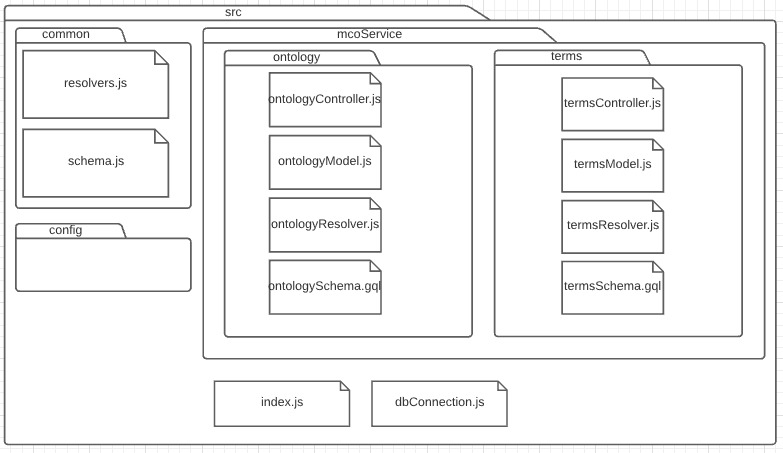

# Maintenance Manual MCO Web Service

## Introduction

This document describes the current status of the MCO Web Service system. The objective is to show and describe the internal structure of each of the components that make it up.

## System internal structure

The folder structure that makes up the system, as shown in the template in Figure 1, is made up of a directory where are the MCOService files **mcoService**, a **common** directory where are the resolvers and schema files, and a **config** directory.
Inside **mcoService** are two directories, **ontology** that contains the controller, moedel, resolvers and schema files for ontology metadata querys, and **terms** that contains the controller, moedel, resolvers and schema files for terms querys.

Figure 1. System folder organization

## Plugins and compatibility with other systems

This web service only needs to run a NodeJS environment, thi means that any computer that runs NodeJS can handle the service.

## Definitions, acronyms and abbreviations

**[NodeJS](https://nodejs.org/en/about/)** - As an asynchronous event-driven JavaScript runtime, Node.js is designed to build scalable network applications.
**[GraphQL](https://graphql.org/)** - GraphQL is a query language for APIs and a runtime for fulfilling those queries with your existing data.
**[Apollo-Server](https://www.apollographql.com/docs/apollo-server/)** - Express and Connect integration of GraphQL Server. Apollo Server is a community-maintained open-source GraphQL server that works with all Node.js HTTP server frameworks: Express, Connect, Hapi, Koa and Restify.
**[Apollo-Server-Express](https://www.apollographql.com/docs/apollo-server/v1/servers/express/)** - Apollo Server is an open-source, spec-compliant GraphQL server that's compatible with any GraphQL client, including Apollo Client.

## Help and Support

If you have a problem or suggestion of any kind related to what is described in this manual, you can send an email to: [regusoft@ccg.unam.mx](mailto:regusoft@ccg.unam.mx)

The documents mentioned as reference in this manual may be requested through the aforementioned address.

## Bibliographic references

**Websites**
Website title: Node.JS
Web link: [https://nodejs.org/en/about/](https://nodejs.org/en/about/)
Website title: GraphQL
Web link: [https://graphql.org/](https://graphql.org/)
Website title: Apollo-Server
Web link: [https://www.apollographql.com/docs/apollo-server/](https://www.apollographql.com/docs/apollo-server/)
Website title: Apollo-Server-Express
Web link: [https://www.apollographql.com/docs/apollo-server/v1/servers/express/](https://www.apollographql.com/docs/apollo-server/v1/servers/express/)

<!---
HISTORIAL DE REVISIONES

**Fecha:** [dd/mm/aaaa]
**Versión:** [#.#]
**Descripción:** [Indicar los cambios que se realizaron en el documento]
**Realizado por: ** [Nombre de la persona que realice los cambios]
**Estado:**[Revisión <Trabajado,  Verificado>, Estable **<**Vo.Bo, Validado>]
[Repetir esta sección por cada versión que se realice en el documento]
-->
